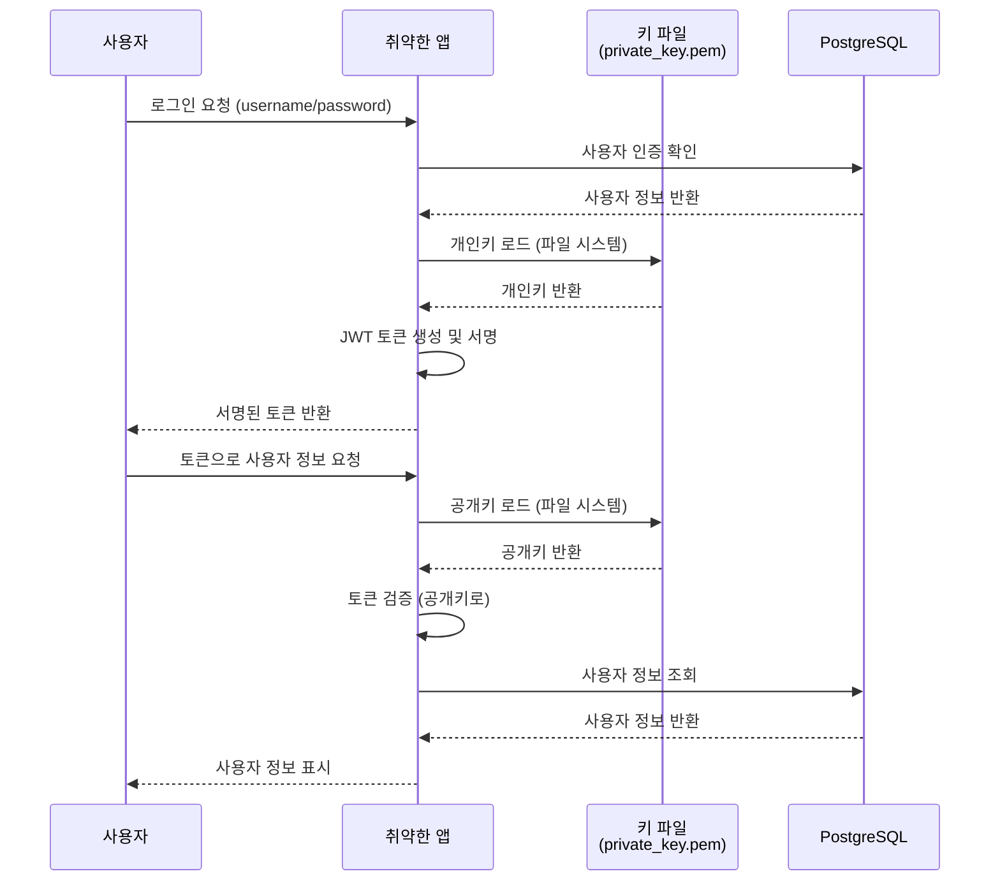
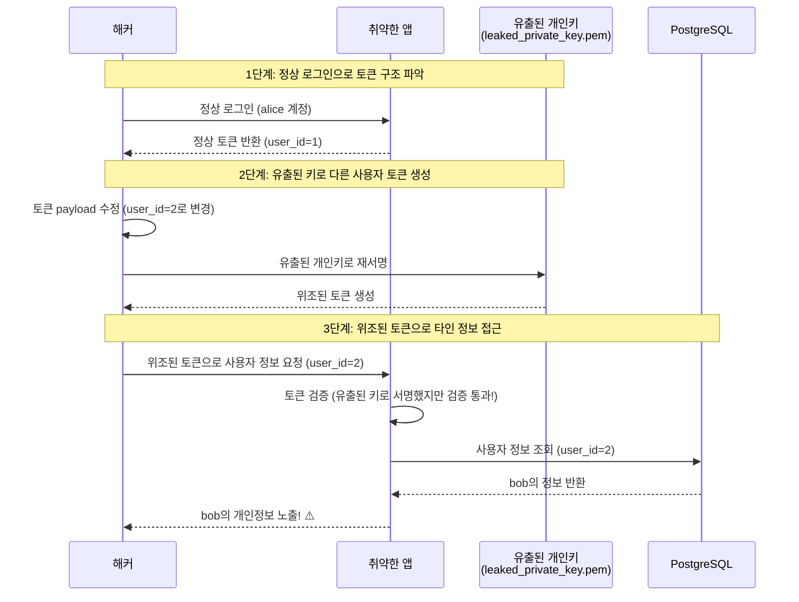
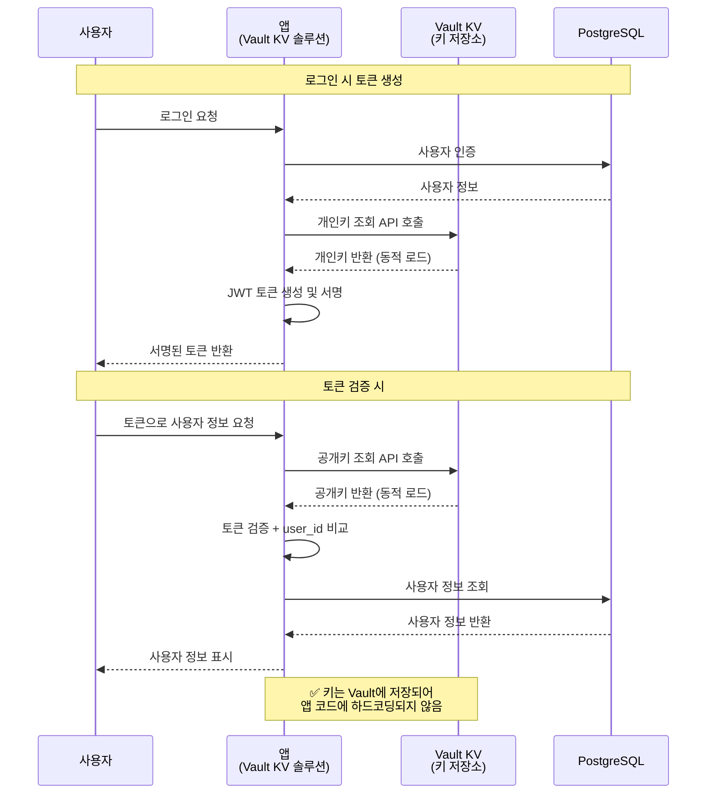
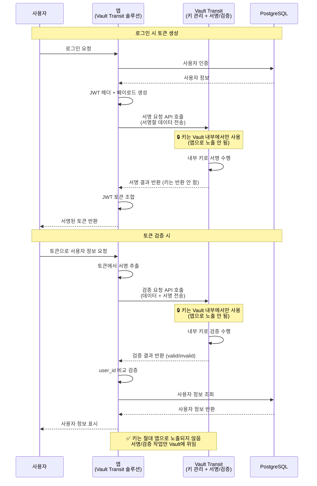

# 취약한 인증 시스템 데모

이 데모는 JWT 토큰 서명 키 유출 및 순차적 사용자 ID를 이용한 보안 취약점을 재현합니다.

## 동작 데모


## 프로젝트 구조

```
coupang-leak-demo-vault/
├── docker-compose.yml          # Docker Compose 설정
├── README.md                   # 이 파일
├── vulnerable-app/             # 취약한 메인 애플리케이션
│   ├── Dockerfile
│   ├── requirements.txt
│   ├── app.py                  # Flask 앱
│   ├── auth.py                 # 인증 로직 (SHA256, JWT)
│   ├── config.py               # 설정 (RSA 키)
│   ├── database.py             # DB 연결 및 쿼리
│   ├── private_key.pem         # RSA 개인키 (서명용)
│   ├── public_key.pem          # RSA 공개키 (검증용)
│   └── templates/
│       ├── index.html
│       ├── login.html
│       ├── user_info.html
│       └── attack_demo.html    # 공격 데모 UI
├── vault-kv-solution/          # Vault KV 솔루션 앱
│   ├── Dockerfile
│   ├── requirements.txt
│   ├── app.py                  # Flask 앱
│   ├── auth.py                 # 인증 로직 (Vault KV 사용)
│   ├── config.py               # Vault KV 설정
│   ├── database.py             # DB 연결 및 쿼리
│   └── templates/
│       ├── index.html
│       ├── login.html
│       └── user_info.html
├── vault-transit-solution/     # Vault Transit 솔루션 앱
│   ├── Dockerfile
│   ├── requirements.txt
│   ├── app.py                  # Flask 앱
│   ├── auth.py                 # 인증 로직 (Vault Transit 사용)
│   ├── config.py               # Vault Transit 설정
│   ├── database.py             # DB 연결 및 쿼리
│   └── templates/
│       ├── index.html
│       ├── login.html
│       └── user_info.html
├── hack-demo/                  # 해킹 데모
│   ├── exploit.py              # Python 공격 스크립트
│   ├── exploit.html            # 브라우저 공격 데모
│   ├── generate_token.sh       # OpenSSL을 사용한 토큰 생성 스크립트
│   ├── leaked_private_key.pem  # 유출된 개인키 (해커가 획득)
│   ├── requirements.txt        # Python 의존성
│   └── README.md
└── scripts/
    ├── init_db.sql             # PostgreSQL 초기화
    └── vault/
        ├── init_vault.sh       # Vault 초기화 스크립트
        └── vault-entrypoint.sh # Vault 자동 초기화 엔트리포인트
```

## 취약점 설명

1. **서명 키 유출**: RSA 개인키가 유출됨 (로그, 설정 파일, 환경 변수 등)
2. **약한 토큰 검증**: 서명 검증 실패 시에도 서명 검증 없이 디코딩만 수행
3. **user_id 검증 부재**: URL 파라미터의 user_id를 검증 없이 사용
4. **순차적 사용자 ID**: 데이터베이스의 사용자 ID가 1, 2, 3... 순차적

## 취약한 인증 시스템 흐름

### 정상 인증 흐름



### 해커의 공격 흐름



## 실행 방법

### 1. 서비스 시작

```bash
docker-compose up -d
```

### 2. 앱 접속

브라우저에서 http://localhost:5001 접속

### 3. 로그인

- 사용자명: alice, bob, charlie, david, eve 등
- 비밀번호: password123 (모든 사용자 동일)

### 4. 해킹 데모 실행

#### UI 데모 (권장)

브라우저에서 http://localhost:5001/attack-demo 접속하여 단계별로 공격을 시뮬레이션합니다.

1. 사용자 목록 확인
2. 유출된 키로 비정상 토큰 생성
3. 생성한 토큰으로 타인 정보 접근
4. 직접 토큰 입력하여 테스트

#### Python 스크립트 + UI 연동

1. Python 스크립트 실행:
```bash
cd hack-demo
pip3 install -r requirements.txt
python3 exploit.py
```

2. 스크립트가 생성한 토큰을 복사합니다 (각 단계마다 토큰이 출력됩니다)

3. UI의 "4단계: 직접 토큰 입력하여 테스트"에 토큰을 붙여넣습니다
   - 토큰을 붙여넣으면 자동으로 토큰의 user_id가 추출되어 설정됩니다
   - 다른 사용자 ID로 접근하려면 user_id를 변경할 수 있습니다
   - "토큰 테스트" 버튼을 클릭하여 공격을 시뮬레이션합니다

#### OpenSSL을 사용한 토큰 생성 (exploit.py 없이)

OpenSSL과 기본 명령어만으로도 토큰을 생성할 수 있습니다:

```bash
cd hack-demo
./generate_token.sh <user_id> <username> <email>
```

예시:
```bash
# 사용자 ID 2 (bob)의 토큰 생성
./generate_token.sh 2 bob bob@example.com

# 사용자 ID 5 (eve)의 토큰 생성
./generate_token.sh 5 eve eve@example.com
```

생성된 토큰을 UI의 "4단계: 직접 토큰 입력하여 테스트"에 붙여넣어 테스트할 수 있습니다.

**수동으로 토큰 생성하기:**

더 자세한 제어가 필요하다면 다음 단계를 따르세요:

1. JWT 페이로드 생성:
```bash
# payload.json 파일 생성
cat > payload.json <<EOF
{
  "user_id": 2,
  "username": "bob",
  "email": "bob@example.com",
  "iat": $(date +%s),
  "exp": $(($(date +%s) + 86400)),
  "iss": "vulnerable-app"
}
EOF
```

2. 헤더와 페이로드를 Base64 URL 인코딩:
```bash
HEADER='{"alg":"RS256","typ":"JWT"}'
HEADER_B64=$(echo -n "$HEADER" | base64 | tr -d '=' | tr '/+' '_-')
PAYLOAD_B64=$(cat payload.json | base64 | tr -d '=' | tr '/+' '_-')
```

3. OpenSSL로 서명:
```bash
SIGNATURE_INPUT="${HEADER_B64}.${PAYLOAD_B64}"
SIGNATURE=$(echo -n "$SIGNATURE_INPUT" | openssl dgst -sha256 -sign hack-demo/leaked_private_key.pem -binary | base64 | tr -d '=' | tr '/+' '_-')
```

4. JWT 토큰 조합:
```bash
TOKEN="${HEADER_B64}.${PAYLOAD_B64}.${SIGNATURE}"
echo "$TOKEN"
```

#### 브라우저 데모 (별도)

브라우저에서 `hack-demo/exploit.html` 파일을 열고 단계별로 진행

## 공격 시나리오

1. **정상 로그인**: 해커가 alice 계정으로 정상적으로 로그인
2. **토큰 정보 확인**: 로그인시 받은 JWT 토큰의 payload 구조 확인
3. **토큰 수정 및 재서명**: 
   - 받은 토큰의 payload를 수정 (user_id를 다른 사용자로 변경)
   - 이미 획득한 서명 키로 재서명
4. **타인 정보 접근**: 재서명한 토큰으로 다른 사용자 정보 조회

## 기술 스택

- Python 3.11
- Flask 3.0.0
- PostgreSQL 17
- PyJWT 2.8.0 (RS256)
- hashlib (SHA256)
- psycopg2-binary 2.9.9
- cryptography 41.0.7
- HashiCorp Vault 1.21 (키 관리)
  - Vault KV v2 (키 저장)
  - Vault Transit (키 관리 및 서명/검증)

## 주의사항

⚠️ **이 데모는 보안 취약점을 재현하기 위한 것입니다. 실제 프로덕션 환경에서는 절대 사용하지 마세요.**

## 해결 방안

이 취약점을 해결하기 위한 방안으로 Vault를 사용한 키 관리 솔루션을 제공합니다.

### Vault KV 솔루션 (방안 1)

- **접속**: http://localhost:5002
- **개선 사항**:
  - 서명 키가 Vault KV에 안전하게 저장됨
  - 앱은 필요할 때마다 Vault에서 키를 동적으로 로드
  - 키가 앱 코드에 하드코딩되지 않아 유출 위험 감소
  - 토큰의 user_id와 요청한 user_id를 비교하여 검증

#### Vault KV 솔루션 흐름



### Vault Transit 솔루션 (방안 2)

- **접속**: http://localhost:5003
- **개선 사항**:
  - 서명 키가 Vault Transit에서 생성 및 관리됨
  - 앱에서 키를 직접 접근할 수 없음 (서명/검증만 가능)
  - Vault Transit이 키 회전을 자동으로 관리
  - 토큰의 user_id와 요청한 user_id를 비교하여 검증

#### Vault Transit 솔루션 흐름



### Vault Enterprise 추가 기능

이 데모는 Vault OSS (Open Source) 버전을 사용하지만, Vault Enterprise에서는 더 강력한 보안 기능을 제공합니다:

#### 1. Vault KV + Control Groups

Vault Enterprise의 **Control Groups** 기능을 사용하면, KV에 저장된 키에 접근할 때 추가 승인 절차를 요구할 수 있습니다.

**기능 설명:**
- 내부 사용자라도 KV의 값을 조회하려면 추가 승인자(Approver)의 승인 필요
- 다중 승인자 설정 가능 (예: 2명 중 1명 승인, 3명 중 2명 승인 등)
- 승인 요청은 이메일, Slack, PagerDuty 등으로 전송 가능
- 승인 전까지는 키에 접근 불가

**적용 예시:**
```hcl
# Control Group 정책 예시
path "secret/data/jwt-signing-key" {
  capabilities = ["read"]
  control_group = {
    max_ttl = "1h"
    factor "approvers" {
      identity {
        group_names = ["security-team"]
        approvals = 1
      }
    }
  }
}
```

이렇게 설정하면, 앱이 Vault KV에서 키를 조회하려고 할 때마다 보안팀의 승인이 필요합니다.

#### 2. Vault Transit + Sentinel + 양자내성 암호화

Vault Enterprise의 Transit 엔진은 더 강력한 보안 기능을 제공합니다:

**Sentinel 정책으로 키 Export 방지:**
```hcl
# Sentinel 정책 예시
import "strings"

precondition = {
  "transit/keys" = "strings.has_prefix(request.path, 'transit/keys/')"
}

main = rule {
  not request.operation == "export"
}
```

이 정책으로 키를 export하는 작업을 완전히 차단할 수 있습니다.

**자동 키 회전:**
- Vault Transit은 설정된 주기(예: 30일, 90일)에 따라 자동으로 키를 회전
- 이전 키 버전은 자동으로 보관되어 기존 토큰 검증 가능
- 새로운 토큰은 최신 키 버전으로 자동 서명

**양자내성 암호화 지원:**
- **ML-DSA (Module-Lattice Digital Signature Algorithm)**: 양자 컴퓨터 공격에 안전한 서명 알고리즘
- **SLH-DSA (Stateless Hash-Based Digital Signature Algorithm)**: 해시 기반 양자내성 서명 알고리즘
- 기존 RSA 키와 함께 사용 가능하며, 점진적 마이그레이션 지원

**적용 예시:**
```bash
# 양자내성 키 생성
vault write transit/keys/jwt-signing-key-pqc \
    type=ml-dsa-44 \
    exportable=false \
    auto_rotate_period=30d

# 또는 SLH-DSA 사용
vault write transit/keys/jwt-signing-key-pqc \
    type=slh-dsa-shake-128s \
    exportable=false \
    auto_rotate_period=30d
```

### Vault 초기화

Vault는 **자동으로 초기화**됩니다. Vault 컨테이너가 시작되면 자동으로:
1. Vault 서버 시작
2. Vault가 준비될 때까지 대기
3. KV v2 엔진 활성화
4. RSA 키를 Vault KV에 저장
5. Transit 엔진 활성화 및 키 생성

수동으로 초기화하려면:

```bash
export VAULT_ADDR=http://localhost:8200
export VAULT_TOKEN=root-token
bash scripts/vault/init_vault.sh
```

또는 Docker 컨테이너 내에서:

```bash
docker exec -it <vault-container-name> bash /vault/scripts/init_vault.sh
```

### 전체 서비스 접속 정보

- 취약한 앱: http://localhost:5001
- Vault KV 솔루션: http://localhost:5002
- Vault Transit 솔루션: http://localhost:5003
- Vault UI: http://localhost:8200 (토큰: root-token)

